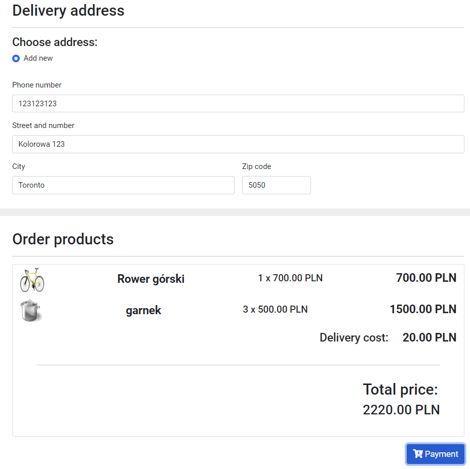
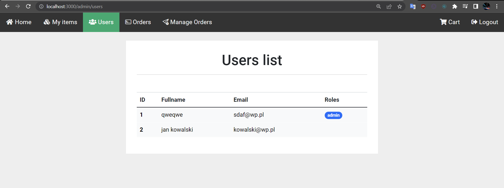

## **Express Shop** _by Mateusz Kisiel_

### Opis projektu:
Jest to sklep internetowy napisany w express.js. Użytkownik może wybrać produkty, dodać do koszyka, zarejestrować się i składać zamówienia. 
Adnimistrator dodawać/edytować/usuwać nowe produkty, a także oznaczyć zamówienia jako zrealizowane. 

### Screeny programu:

### Jak uruchomić:
1) Pobranie zależności:
    > npm install
2) Stworzyć plik .env z danymi do bazy danych oraz kluczy google i facebook (do szybkiego logowania)
Wzór znajduje się w pliku .env-example
3) Wykonanie wszystkich migracji w bazie danych, tworzac odpowiednie tabele:
    > npm run typeorm migration:run
4) Odpalenie w trybie debugowania:
     > npm start 
5) Aby nadać uprawnienia administratora należy ręcznie stworzyć nowy rekord w tabeli user_roles_role 

### Pomocne komendy:
* Dodawanie migracji:
    > npm run typeorm migration:generate -- -n "Nazwa migracji" 

* Uruchamianie migracji 
    > npm run typeorm migration:run

* Lista migracji:
    > npm run typeorm migration:show

### Przydatne informacje:
* User może dodawać produkty do koszyka, a następnie składać, zamówienie.
Dowolny admin może następnie oznaczyć dane zamówienie jako wysyłanie
Następnie klient możeo oznaczyć wysłane zamówienie jako otrzymane

* Przy tworzniu zamówienia user może wybrać dowolny użyty wcześniej przez niego adres, lub wpisać nowy, który automatycznie się doda do listy na przyszłość.

* Itemy nie są usuwane z bazy danych, a dostają flagę jako usunięte, bo złożone zamówienia mogą się opierać o stare wersje produktów

* Przy składaniu zamówienia nie wystepuje proces płatności za produkty

* Zakładka orders jest dla klientow, a manage orders dla admina

* Działa opcja logowania także za pomocą googla i facebooka (w .env są dla nich działające klucze)
